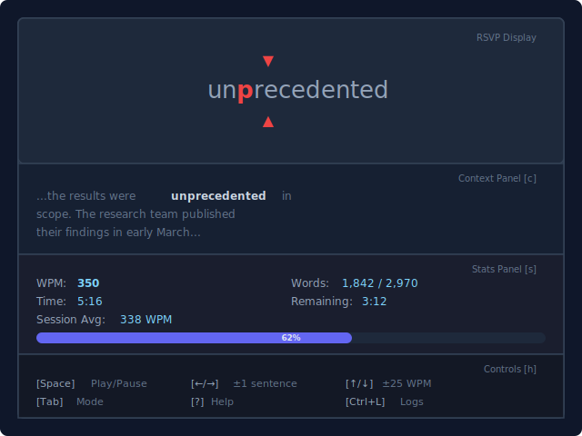

# Acceliterate — v1 Features Spec

**Parent spec:** [v0 design spec](2026-04-08-spreader-tui-design.md)

**Depends on:** Working v0 (RSVP reader with txt loading, ORP, variable timing, stats panel).

---

## Overview

v1 builds on the v0 RSVP reader to deliver the full reading application: multi-format document support, document library with persistence, highlighted scroll reading mode, training features, and comprehensive configuration.

---

## 1. Highlighted Scroll Mode

Full text displayed on screen. Individual words highlight in sequence at the target WPM.

- Current word highlighted in accent color
- Surrounding text dimmed
- Auto-scrolls to keep highlighted word visible
- Same variable timing as RSVP mode applies
- Same navigation controls (pause, jump, WPM adjust)

### 1.1 Mode Switching

- `Tab` toggles between RSVP and highlighted scroll
- Position preserved across mode switches
- All panel toggles and settings are independent of mode

### 1.2 Chunked RSVP Display

Configurable chunk size (1-3 words per display):

- Respect phrase boundaries: never split article+noun, preposition+object
- Short function words (the, a, in, of, to, is) attach to next content word via a hardcoded function-word list
- Max chunk width ~15 characters (foveal vision limit)
- CLI flag: `--chunk-size <N>` (default: 1)

---

## 2. Multi-Format Parsing

### 2.1 Parser Trait

Common interface for all formats:

```rust
trait TextParser {
    fn parse(&self, source: &[u8]) -> Result<Document>;
}
```

Returns a `Document` containing `Paragraph` → `Sentence` → `Word` hierarchy.

Format detection by file extension, with magic-byte fallback for ambiguous cases.

### 2.2 Markdown (.md)

- Strip markdown syntax (headings, bold, italic, links, code blocks, etc.)
- Preserve heading hierarchy as section boundaries for the section picker
- Use headings (`#`, `##`, etc.) as chunk boundaries for heuristic chunking

### 2.3 PDF (.pdf)

- Primary: pure Rust PDF text extraction crate (see dependency research)
- Fallback: shell out to `pdftotext -layout -nopgbrk` if primary crate fails or returns empty
- Scanned PDF detection: if text extraction returns <10 words per page, assume scanned → route to OCR pipeline

### 2.4 EPUB (.epub)

- Strip HTML tags, preserve paragraph/chapter structure
- Use chapter boundaries as section boundaries
- **Licensing concern:** The `epub` crate (v2.1.5) is **GPL-3.0**. If the project needs a permissive license, options are: (1) accept GPL-3.0 for the whole project, (2) write a minimal EPUB reader (EPUBs are ZIP files containing XHTML — not terribly complex), or (3) shell out to a CLI tool like Calibre's `ebook-convert`

### 2.5 Clipboard

- `arboard` crate — cross-platform clipboard read
- Triggered via CLI flag (`--clipboard` or `-c`)

### 2.6 OCR Pipeline (Scanned PDFs)

```
Scanned PDF → Render pages to images (pdfium-render, 300 DPI)
            → OCR each page image
            → Collect text
```

**Primary OCR:** `ocrs` (v0.12.2) — pure Rust, zero system deps, MIT licensed. Uses `rten` ONNX runtime internally (transitive dep, no explicit dependency needed). **Limitation:** Latin alphabet only — no CJK or Arabic support.

**Enhanced OCR (if tesseract available):** Detect `tesseract` on PATH at runtime via `rusty-tesseract`. Note: `rusty-tesseract` shells out to the `tesseract` CLI binary — it is NOT FFI bindings. Users must have Tesseract installed.

**PDF page rendering:** `pdfium-render` (v0.9.0) requires the Pdfium shared library (from Chromium) at runtime. The crate has features for bundling/downloading the library, but this is a non-trivial system dependency that must be documented.

**If neither works:** Display clear error: "This appears to be a scanned PDF. Install tesseract for OCR support: brew install tesseract"

---

## 3. Document Selection Interface

The app launches to a **library screen** when no file argument is provided.

### 3.1 App Flow

```
Launch (no args) → Library Screen → (select doc) → Section Picker → Reader
Launch <file>    → Parse file → Section Picker (if sections) → Reader
                        ↑                              ↑
                        └──── q from reader ───────────┘
```

### 3.2 Library Screen

Displays all previously ingested documents:

- **List view** with columns: title, format (pdf/epub/txt), progress %, last read date
- Sorted by last read (most recent first)
- Arrow keys to navigate, Enter to select
- Search/filter by typing (fuzzy match on title)
- `o` — open new file (enters file picker)
- `v` — paste from clipboard
- `d` — remove document from library
- `q` — quit app

### 3.3 File Picker (for `o` / open new)

- Text input for file path with **tab-completion** (like shell `cd <tab>`)
- Completes directory names and filters to supported extensions (.txt, .md, .pdf, .epub)
- Enter to confirm, Esc to cancel back to library
- On confirm: file is parsed, added to library index, then opens section picker

### 3.4 Section Picker

After selecting a document, if it has detectable sections:

- **Chapter/section list** extracted via heuristic chunking
- Shows section title + word count
- Arrow keys to navigate, Enter to start reading from that section
- `r` — resume from bookmark (if one exists)
- Enter on first item starts from the beginning
- Esc to go back to library

If the document has no detectable sections (e.g., plain .txt with no headings), skip this screen and go directly to the reader.

### 3.5 Heuristic Chunking

Section detection strategy by format:

| Format | Section boundaries |
|--------|-------------------|
| Markdown | Heading hierarchy (`#`, `##`, etc.) |
| PDF | Large-font lines, all-caps lines, numbered patterns ("Chapter N", "Section N") |
| EPUB | Chapter metadata from OPF manifest + HTML heading tags |
| Plain text | Lines that are all-caps, significantly shorter than surrounding text, or match common heading patterns |

Fallback: if no sections detected, treat the entire document as a single section.

---

## 4. Training Features

### 4.1 Speed Burst (Manual)

- Press `b` to activate
- WPM jumps to 2x current for 30 seconds
- Countdown timer visible in stats panel
- Visual indicator: accent color change on border during burst
- Auto-returns to original WPM when done
- Can press `b` again to cancel early

### 4.2 Guided Training Session

- Press `g` to enter guided mode
- Cycle:
  1. 2 minutes at target WPM
  2. 30 seconds at 1.5x target
  3. 30 seconds at 2x target
  4. Repeat from step 1
- Stats panel shows: current phase name, time remaining in phase, cycles completed
- `Esc` or `g` exits guided mode, returns to normal reading at target WPM

### 4.3 ReadingSession API Additions

```rust
impl ReadingSession {
    // Training
    pub fn start_speed_burst(&mut self);
    pub fn cancel_speed_burst(&mut self);
    pub fn start_guided_session(&mut self);
    pub fn stop_guided_session(&mut self);

    // Mode
    pub fn reading_mode(&self) -> ReadingMode;
    pub fn set_reading_mode(&mut self, mode: ReadingMode);
    pub fn set_chunk_size(&mut self, size: usize);
}
```

---

## 5. UI Enhancements

### 5.1 Full UI Layout



### 5.2 Toggleable Panels

- `c` — context panel on/off (shows current paragraph)
- `s` — stats panel on/off
- `h` — control hints on/off
- All panels default to visible; user can strip down to just the word display for zen mode

### 5.3 Context Panel

Displays the current paragraph with the active word highlighted, providing reading context around the RSVP word.

### 5.4 Log Viewer (Ctrl+L)

- Opens a full-screen scrollable overlay showing consolidated logs
- Logs displayed in reverse chronological order (newest first)
- Color-coded by level: ERROR (red), WARN (yellow), INFO (white), DEBUG (dim)
- Filterable by level (toggle with 1-4 keys while in viewer)
- Searchable (press `/` to search within logs)
- `Esc` closes the viewer and returns to reading
- Reading is auto-paused while log viewer is open

---

## 6. Configuration & Persistence

### 6.1 CLI Arguments (full)

```
acceliterate [OPTIONS] [FILE]

Arguments:
  [FILE]  Path to .txt, .md, .pdf, or .epub file (opens library if omitted)

Options:
  -c, --clipboard       Read from clipboard instead of file
  -w, --wpm <WPM>       Initial words per minute (default: 300)
  --chunk-size <N>      Words per chunk, 1-3 (default: 1)
  --mode <MODE>         Starting mode: rsvp | scroll (default: rsvp)
  -v, --verbose         Enable logging to file
```

### 6.2 Config File

Location: `~/.config/acceliterate/config.toml`

```toml
[reader]
default_wpm = 300
chunk_size = 1
default_mode = "rsvp"

[ui]
show_context = true
show_stats = true
show_hints = true
accent_color = "red"

[training]
burst_duration_secs = 30
burst_multiplier = 2.0
guided_target_secs = 120
guided_burst_15x_secs = 30
guided_burst_20x_secs = 30
```

### 6.3 Library Persistence

Location: `~/.config/acceliterate/library.toml`

```toml
[[document]]
file_path = "/Users/me/books/the-art-of-war.epub"
file_hash = "sha256:abc123..."
title = "The Art of War"
format = "epub"
total_words = 13412
sections = ["I. Laying Plans", "II. Waging War", "III. Attack by Stratagem"]
added_at = "2026-04-08T10:00:00Z"
last_read = "2026-04-08T10:30:00Z"
bookmark_word_index = 4521
bookmark_wpm = 350
progress = 0.337
```

### 6.4 Bookmarks

Location: `~/.config/acceliterate/bookmarks.toml`

Keyed by file hash (so renames don't break bookmarks):
```toml
[[bookmark]]
file_hash = "sha256:abc123..."
file_name = "the-art-of-war.epub"
word_index = 4521
wpm = 350
last_read = "2026-04-08T10:30:00Z"
```

### 6.5 Session History

Location: `~/.config/acceliterate/history.toml`

```toml
[[session]]
file_name = "the-art-of-war.epub"
date = "2026-04-08T10:30:00Z"
words_read = 2450
duration_secs = 480
avg_wpm = 306
```

### 6.6 Logging

- Logs always collected in an in-memory ring buffer (last ~1000 entries) for the Ctrl+L viewer
- `--verbose` / `-v` flag additionally writes logs to `~/.config/acceliterate/logs/acceliterate-YYYY-MM-DD.log`
- Uses `tracing` + `tracing-appender` for structured logging
- Log levels: ERROR (always), WARN, INFO, DEBUG (with -v), TRACE (with -vv)
- Covers: file parsing events, OCR pipeline steps, config loading, error details, timing calculations

---

## 7. Full Keybindings (v0 + v1)

| Key | Action | Version |
|-----|--------|---------|
| Space | Play / Pause | v0 |
| Left arrow | Jump back 1 sentence | v0 |
| Right arrow | Jump forward 1 sentence | v0 |
| Up arrow | Increase WPM by 25 | v0 |
| Down arrow | Decrease WPM by 25 | v0 |
| `?` | Full help overlay | v0 |
| `q` | Quit | v0 |
| Tab | Toggle reading mode (RSVP ↔ scroll) | v1 |
| `b` | Start/cancel speed burst | v1 |
| `g` | Start/stop guided training session | v1 |
| `c` | Toggle context panel | v1 |
| `s` | Toggle stats panel | v1 |
| `h` | Toggle control hints | v1 |
| Ctrl+L | Open log viewer overlay | v1 |

---

## 8. Full Source Tree (v1)

```
src/
  main.rs              -- terminal setup/teardown, main loop
  app.rs               -- App struct (TUI state), maps core state to UI
  event.rs             -- keyboard event handling, maps keys → core actions

  core/                -- FRONTEND-AGNOSTIC (no ratatui, no crossterm)
    mod.rs             -- public API re-exports
    reader.rs          -- ReadingSession: the main engine
    document.rs        -- Document, Paragraph, Sentence, Word structs
    tokenizer.rs       -- text → Document: tokenization, ORP computation, timing calc
    timing.rs          -- variable timing logic (word length, punctuation multipliers)
    orp.rs             -- ORP index calculation, word alignment
    training.rs        -- speed burst logic, guided session state machine
    stats.rs           -- session stats tracking (words read, avg WPM, elapsed time)
    config.rs          -- reader config (WPM, chunk size, mode, training params)
    library.rs         -- document library: index of ingested docs, metadata, bookmarks
    parser/
      mod.rs           -- format detection, TextParser trait
      txt.rs           -- plain text loader
      markdown.rs      -- markdown parser (strip syntax, extract headings as sections)
      pdf.rs           -- PDF text extraction (primary crate + pdftotext fallback)
      epub.rs          -- EPUB text extraction
      clipboard.rs     -- clipboard paste support
      ocr.rs           -- scanned PDF OCR pipeline

  ui/                  -- TUI-SPECIFIC (ratatui + crossterm)
    mod.rs             -- top-level layout, delegates to sub-renderers
    rsvp.rs            -- RSVP word display with ORP highlighting + redicle
    scroll.rs          -- highlighted scroll mode renderer
    stats.rs           -- stats panel (WPM, words read, time, progress)
    context.rs         -- context paragraph panel
    controls.rs        -- bottom control hints bar
    help.rs            -- full-screen help overlay
    logs.rs            -- full-screen log viewer overlay (Ctrl+L)
    library.rs         -- document library / selection screen
    file_picker.rs     -- file path input with tab-completion
    section_picker.rs  -- chapter/section selection within a document
```

---

## 9. v1 Dependencies (additions over v0)

```toml
# Error types
thiserror = "2"

# Serialization / config persistence
serde = { version = "1", features = ["derive"] }
toml = "1.1"

# Clipboard
arboard = "3"

# Text extraction
pdf_oxide = "0.3"                # Pure Rust PDF text extraction (young but fast, MIT)
# epub = "2.1"                   # EPUB reading — GPL-3.0! See Section 2.4 for alternatives
pulldown-cmark = "0.12"          # Markdown parsing

# OCR
ocrs = "0.12"                    # Pure Rust OCR (Latin only)
rusty-tesseract = "1"            # Tesseract CLI wrapper (fallback for non-Latin)
pdfium-render = "0.9"            # PDF page → image rendering (requires Pdfium shared lib)

# Logging
tracing = "0.1"
tracing-subscriber = "0.3"
tracing-appender = "0.2"
```

**Research notes (Apr 2026):**
- `pdf_oxide` (v0.3.21): real and promising but only 5 months old, single maintainer. `pdftotext` shell fallback is essential insurance.
- `epub` crate: GPL-3.0 is the only EPUB reader in the ecosystem. Decision needed on licensing strategy.
- `ocrs`: 1.8k GitHub stars, actively maintained by Robert Knight. Uses `rten` ONNX runtime as transitive dep.
- `rusty-tesseract`: shells out to `tesseract` CLI (not FFI). Last release Mar 2024 — maintenance slowing.
- `pulldown-cmark`: the standard Rust Markdown parser, MIT licensed, actively maintained.

---

## 10. Error Handling (v1 additions)

- `thiserror` for custom error types in parser module
- Graceful degradation: if PDF primary crate fails → try pdftotext → show error with suggestions
- OCR fallback chain: ocrs → rusty-tesseract → helpful error message
- Library file corruption → warn and rebuild from file system

---

## 11. Terminal Size Handling

- Minimum terminal size: 40 columns x 10 rows
- If terminal is below minimum, show a "resize terminal" message instead of the reader
- RSVP ORP alignment recalculates on terminal resize
- Scroll mode reflows text to terminal width on resize
