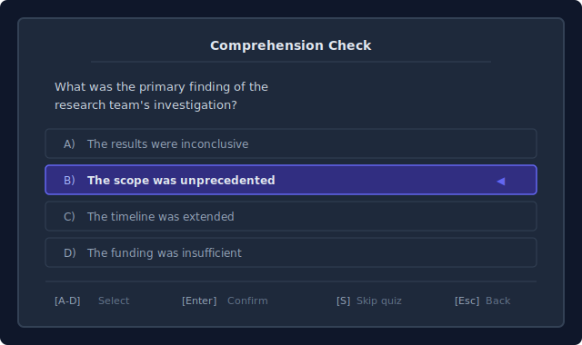

# v2 — LLM Comprehension Quiz Mode

**Parent spec:** [spreader-tui-design.md](2026-04-08-spreader-tui-design.md)

**Scope:** Implemented after v1. Depends on v0 heuristic chunking and v1 session stats infrastructure.

---

## 1. Concept

After reading a chunk/section of text, the reader is quizzed on comprehension. An LLM pre-generates questions per chunk at ingest time. The real metric becomes *effective reading rate*: `WPM x comprehension%`.

**Flow:**
1. User opens a document
2. Document is split into chunks (heuristic chunking from v0)
3. For each chunk, an LLM call generates quiz questions + answer key (background thread)
4. User reads chunk N while quiz for chunk N+1 is generated ahead
5. At chunk boundary, quiz is presented
6. Results are scored and persisted

---

## 2. Quiz Triggers

- **Automatic**: at chunk/section boundaries (chapter breaks, section headings)
- **On-demand**: press a quiz key to test yourself anytime mid-chunk
- **Configurable interval**: every N paragraphs as fallback when no structural boundaries exist

---

## 3. Question Types

**Multiple Choice (primary, especially early on):**
- 3-5 answer options per question
- 3-5 questions per quiz
- Covers: main idea, key details, sequence of events, vocabulary in context
- User selects A/B/C/D/E

**Free Response (mixed in as user improves):**
- Open-ended questions requiring typed answers
- LLM evaluates the response for accuracy and completeness
- Scored on a scale (0-100%) with brief feedback

---

## 4. Difficulty Progression

- Start with multiple choice only
- After sustained >70% comprehension: mix in 1 free response per quiz
- After sustained >80%: increase free response ratio
- If comprehension drops below 60%: reduce WPM suggestion, return to MC only

---

## 5. LLM Integration

### 5.1 Provider Trait

Defined in `core/llm/mod.rs` (architecture from main spec):

```rust
pub trait LlmProvider: Send {
    fn generate_quiz(&self, passage: &str, config: &QuizConfig) -> Result<Quiz>;
    fn evaluate_response(&self, passage: &str, question: &str, answer: &str) -> Result<Evaluation>;
    fn name(&self) -> &str;
}
```

### 5.2 Providers (all first-class)

| Provider | Transport | Crate | Notes |
|----------|-----------|-------|-------|
| Ollama | HTTP to localhost:11434 | `ureq` 3.x | Default local option |
| llama.cpp | In-process FFI | `llama-cpp-2` (v0.1.x) | CPU/GPU-bound, background thread. Note: `llama-cpp-rs` is abandoned — use `llama-cpp-2` from utilityai/llama-cpp-rs |
| Anthropic | HTTPS to api.anthropic.com | `ureq` 3.x | Cloud, API key required |
| OpenAI-compatible | HTTPS to configurable base URL | `ureq` 3.x | Covers OpenAI, Azure, any compatible endpoint |

### 5.3 Quiz Generation Pipeline

- Happens at **ingest time**, not during reading
- Background thread per chunk: `std::thread::spawn` + `mpsc::channel`
- Main loop picks up results via `llm_rx.try_recv()` (non-blocking)
- Quiz results cached per chunk — no re-generation on re-read

### 5.4 Config

```toml
[llm]
provider = "ollama"
model = "llama3.2"
base_url = "http://localhost:11434"
api_key = ""  # for anthropic/openai, or set env var

[quiz]
questions_per_chunk = 5
auto_trigger = true
trigger_interval_paragraphs = 0  # 0 = use structural boundaries only
```

---

## 6. Comprehension Tracking

- Per-session comprehension score (rolling average)
- Per-session effective reading rate: `avg_wpm x avg_comprehension`
- Historical tracking in session history (persisted)
- Visual display in stats panel when quiz mode is active

---

## 7. Quiz Persistence

Quiz results and generated questions are persisted so reopening a document doesn't re-run LLM generation:

Location: `~/.config/acceliterate/quizzes/`

Keyed by document hash + chunk index:
```toml
[[quiz]]
doc_hash = "sha256:abc123..."
chunk_index = 3
questions = [...]  # serialized Quiz struct
generated_at = "2026-04-08T10:30:00Z"
provider = "ollama"
model = "llama3.2"
```

---

## 8. UI for Quiz Mode



---

## 9. Future Considerations (beyond v2)

- **LLM-assisted chunking**: if heuristic chunking proves insufficient after user testing, use the LLM to identify optimal section boundaries
- **LLM-generated summaries**: per-chunk and whole-document summaries for overall comprehension tests
- **Adaptive difficulty**: LLM adjusts question complexity based on user's historical performance
- **Spaced repetition**: re-quiz on previously read material at increasing intervals
